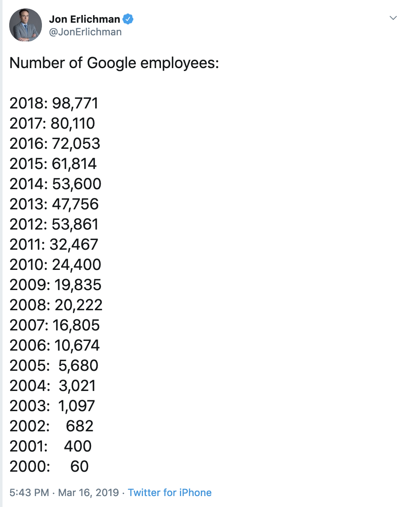
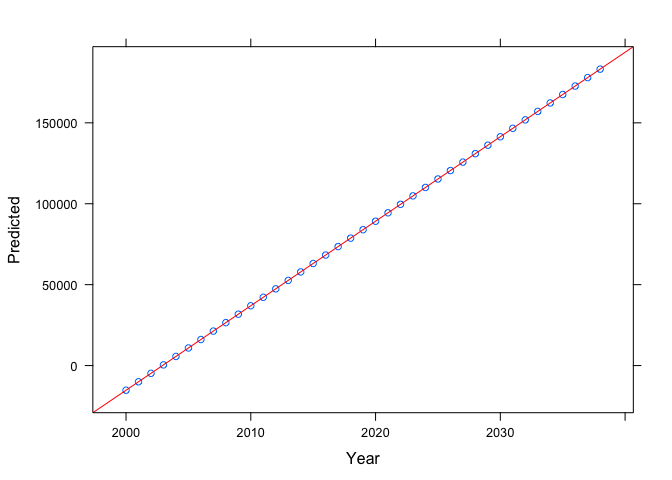
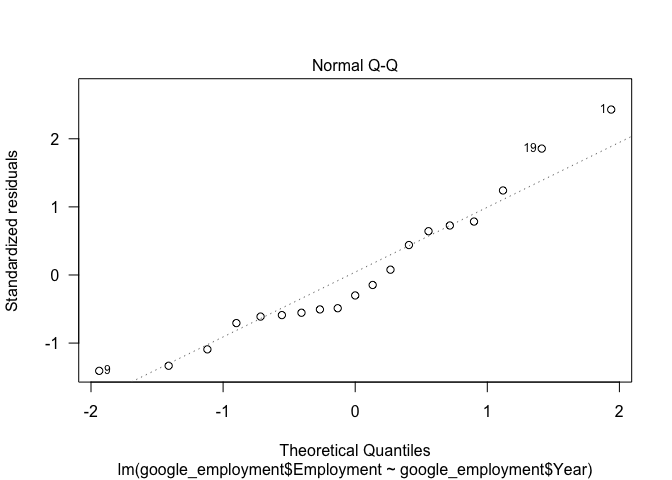
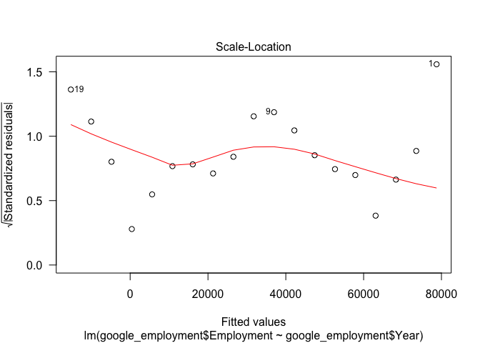
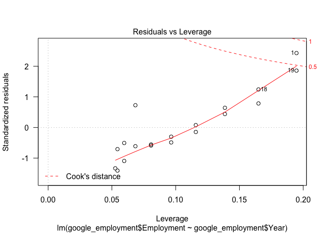

## Inspired by Twitter

This was inspired by a Tweet from [@JonErlichman](https://twitter.com/JonErlichman/status/1107034647119257601):

 

## Data
I "scraped" the data from the Tweet (this involves me copy-and-pasting into Excel...), here it is again:

```r
google_employment <- read_csv("google-employment.csv")
```

```
## Parsed with column specification:
## cols(
##   Year = col_double(),
##   Employment = col_number()
## )
```

```r
kable(google_employment)
```


 Year   Employment
-----  -----------
 2018        98771
 2017        80110
 2016        72053
 2015        61814
 2014        53600
 2013        47756
 2012        53861
 2011        32467
 2010        24400
 2009        19835
 2008        20222
 2007        16805
 2006        10674
 2005         5680
 2004         3021
 2003         1097
 2002          682
 2001          400
 2000           60

## Google takes over the world

```r
model <- lm(google_employment$Employment ~ google_employment$Year)
summary(model)
```

```
## 
## Call:
## lm(formula = google_employment$Employment ~ google_employment$Year)
## 
## Residuals:
##    Min     1Q Median     3Q    Max 
## -12574  -5301  -2625   5961  20025 
## 
## Coefficients:
##                          Estimate Std. Error t value Pr(>|t|)    
## (Intercept)            -1.046e+07  7.730e+05  -13.53 1.57e-10 ***
## google_employment$Year  5.222e+03  3.848e+02   13.57 1.50e-10 ***
## ---
## Signif. codes:  0 '***' 0.001 '**' 0.01 '*' 0.05 '.' 0.1 ' ' 1
## 
## Residual standard error: 9187 on 17 degrees of freedom
## Multiple R-squared:  0.9155,	Adjusted R-squared:  0.9105 
## F-statistic: 184.1 on 1 and 17 DF,  p-value: 1.501e-10
```

```r
plot(model,las=1)
```

<!-- --><!-- --><!-- --><!-- -->

